# JOURNAL
Systemd permet la unificació dels diferents tipus de missatge que es generen
al sistema, ja sigui que provinguin de dimonis o de processos. El sistema que
recull i administra els logs rep el nom de **journal**.

Aquest és implementat pel dimoni **journald**, que recull missatges de tot 
tipus: kernel, initrd, serveis...

Els fitxers de logs de journal estan en format binari, i han de ser processats
per poder ser llegits. Aquest processat la fa la ordre `journalctl`. Aquesta
ordre té una opció que permet mostrar els logs en diferents formats, que
es presentaran en aquest tema.

## Característiques de journal
Algunes de les característiques que ens aporta journal vers syslog són les segúents:

* Simplicitat: poc codi i mínim desperdici.

* No requereix manteniment: es pot implementar rotació del journal.

* Robust: la informació dels arxius de logs són accessibles per als administradors 
i poden ser copiats a diferents hosts amb eines com *“scp”* o *“rsync”*. 
No cal tenir el dimoni ences per a buscar arxius del journal.

* Rendiment: és ràpid en termes de complexitat. És aconsellable per a poder 
fer un seguiment i tenir un bon rendiment alhora.

* Integració: Està integrat a la resta del sistema, ja que el logging és 
crucial per a un servei.

* Unificació: les diferents tecnologies de login haurien d'unificarse amb una mateixa
estructura per a la informació, i així funciona journal. Les entrades de firmware 
són seguides per les del kernel, i les ultimes, les d'usuaris.

## EXEMPLES DE CAMPS CAMPS
### CAMPS D'USUARIS (de clients)
MESSAGE= 

	Cadena de missatge que pot entendre una persona

PRIORITY= 

	Valor de prioritat entre 0 ("emerg") i 7 ("debug"); compatible amb syslog

### CAMPS CONFIABLES (no poden ser alterats)
_PID=, _UID=, _GID= 

	El proces, usuari, i ID del grup ID del procés.

_COMM=, _EXE=, _CMDLINE= 

	Nom del servei o path d'aquest del qual s'origina el procés.

_HOSTNAME= 

	Nom del host d'on s'executa el servei.

### CAMPS DEL KERNEL
_KERNEL_DEVICE= 

	Nom del device del kernel
	
	_UDEV_SYSNAME= 
	
	  The kernel device name as it shows up in the device tree below /sys. 
	  
	_UDEV_DEVNODE= 
	
	  Node del path del device (/dev)-
	  

### CAMPS EMPRATS PER PROGRAMES
OBJECT_PID=PID 

	PID del programa al qual pertany el missatge. 

__REALTIME_TIMESTAMP= 

	Temps en el qual journal ha rebut la entrada segons UTC, en un format
	que mostra els microsegons

__MONOTONIC_TIMESTAMP= 

	Temps en format monotonic(CLOCK_MONOTONIC) que es mostrat segons en quin
	moment journal ha rebut, en un format que mostra els microsegons.
	Pot ser combinat amb "_BOOT_ID=". 

## MANIPULAR SYSTEMD AMB JOURNAL
### BUSCAR LOG SERVEI
journalctl *path-to-daemon*
journalctl _COMM=*daemon-name*
journalctl --unit *daemon-name*

### INFO BOOT
journalctl --list-boots →llistar boots registrats

journalctl --boot → llistar últim boot

journalctl --boot -1 → llista info boot amb ID 1

journalctl --boot -fc9....6e08 → llistar boot amb ID x 

### LOGS SEGONS EL TEMPS
Aquesta és una utilitat molt acertada per a aquells servidors que romanen 
molt de temps en funcionament.
Mitjançant les opcions --since i --until, permet posar restriccions a l'hora 
de mostrar els logs (segons si es volen mostrar els que s'han fet abans o 
després del moment desitjat).
El valor del dia i l'hora poden tenir diversos formats, però el més recomanable és:

	YYYY-MM-DD HH:MM:SS

Per posar un exemple, si es vol consultar els logs generats des del dia 01 
del mes actual, Maig, emprariem la opció --since de la següent manera:

	journalctl --since "2016-05-01 00:00:00'' 

Si un dels valors és absent, agafa certs valors establerts per defecte. 
Per exemple, si la data és omitida, la data d'avui és la que pren com a 
valor. O si no hi ha hora establerta, el valor per defecte és “00:00:00”. 
Prenent com a model la següent ordre:

	journalctl --since "2016-01-10" --until "2016-01-11 09:00"

El valor de la data del dia 10 seria les 00:00:00, i del dia 11, el camp 
dels segons per defecte és "00''.
També li podriem passar com a opció altres valors, com *yesterday*, *today*, 
*tomorrow* o *now*.

	journalctl --since yesterday

Fins i tot podriem fer cerques sobre un temps predeterminat:

	journalctl --since 09:00 --until "1 hour ago"

Exemple pràctic: Visualització dels logs en els darrers 5min. 

1. Es mostrarà que no hi ha cap log:

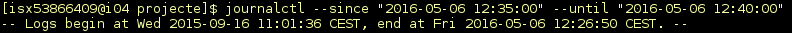

2. Encenem servei slapd, per a que generi logs: **systemctl start slapd**

3. Tornem a comprovar els logs en el mateix interval de temps que abans.

### FILTRAR PER PROCES, USUARI O GRUPID
Donat un determinat servei, pot tenir diversos processos fills. Si es vol 
filtrar segons el número exacte de PID del procés cal realitzar:

	journalctl _PID=nºpid

Per filtrar segons el log d'un usuari, primer l'administrador hauria de 
saber quin és el seu UID, que pot extreure fàcilment de la comanda: 
**id --user** ***nomusuari***.

Tot seguit, amb journalctl ja es podria seguir l'objectiu d'esbrinar i 
visualitzar quins logs provenen de l'usuari. Per a realitzar-ho, cal fer 
la ordre:

	journalctl _UID=UID

També, si emprem la opció **--field** seguit de *_UID* o de *_GID*, podem o
btenir una llista de UIDs o GIDs dels qual systemd disposa d'entrades de logs.

### LOGS DEL KERNEL
journalctl -k (la ordre en format extens és: journalctl *--dmesg*)

### LLISTAR SEGONS LA PRIORITAT
Com a administradors del sistema, també interessa filtrar els missatges 
segons la seva prioritat. Sovint és útil guardar els logs amb un alt nivell 
de verbose, és a dir, amb gran quantitat d'informació, i quan es processa 
la informació disponible, els logs de baixa prioritat poden distreure i arribar 
a causar confusió.
Per utilitzar journalctl per especificar només el tipus de prioritat a mostrar, 
cal utilitzar la opció *-p* de manera reduïda o *--priority*). Això permetrà filtrar 
els missatges segons la prioritat que volguem. Per veure les entrades del log 
amb la prioritat seleccionada, realitzariem:

	journalctl --priority prioritat

La opció de prioritat en la ordre anterior pot tenir dos diferents valors: 
numèrics o pel nom. La llista de més a menys prioritat és:

* 0: emerg 
* 1: alert 
* 2: crit 
* 3: err 
* 4: warning 
* 5: notice 
* 6: info 
* 7: debug 

Seleccionar una prioritat provocarà que journal mostri els logs d'aquell 
nivel de prioritat i, a més a més, les que pertanyin a un nivell per sobre 
(més importants). Per exemple, si seleccionem el nivell d'alerta 2, mostrarà 
els logs de crit (2), alert (1) i emerg (0).

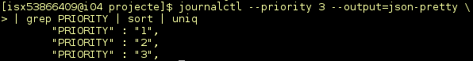

### TOT JOURNAL OUTPUT
Per defecte, la ordre journalctl mostra només una pàgina de la sortida per 
defecte (output). Si volem que mostri tot el llistat de logs i no només 
la última pàgina, la ordre necessària és journalctl **--no-pager**. Aquesta 
ordre també podria ser processada i per exemple, emmagatzemada en el disc 
dur, segons les necessitats que tinguem.

### FORMATS DE SORTIDA
Journal es pot mostrar en diferents formats segons ho necessitem. Per a fer-ho, 
cal emprar la opció *-o* (*--output=*). Els diferents tipus d'opcions són:

* short : és el format per defecte més semblant als arxius de syslog, 
mostrant una linia per cada entrada.

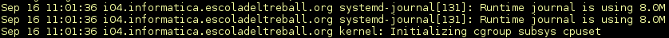

* short-iso : similar a short, però horari segons 8601

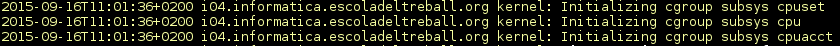

* short-precise : similar a short, però mostrant el temps amb microsegons inclosos.

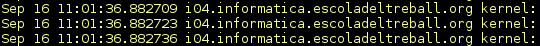

* short-monotonic : mostra el temps en format monotonic.

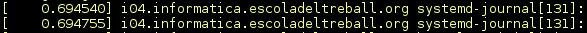

* verbose: mostra mitjançant camps estructurats tota la informació del log.

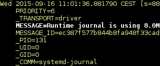

* export: exporta journal en format binari per a poder enviar-lo per xarxa. També serveix per a backups

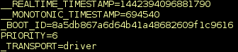

* json: entrades amb estructures de tipus JSON

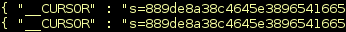

* json-pretty: entrades amb estructures de tipus JSON, però el format és de múltiples linies per cada entrada, permetent que sigui més llegible.

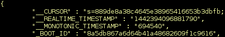

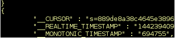

* json-sse: entrades amb estructures de tipus JSON, però en un format adequat per a ser un missatge enviat per servidors	

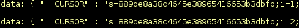

* cat: mostra només el missatge, sense cap altre tipus d'informació (com hora, host...)

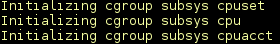

### MONITORITZACIÓ
Per mostrar x número de logs, cal emprar la opció *-n* (**journalctl --lines=**), que 
seria equivalen a *tail -n* (*tail --lines=*). Per defecte, mostra les 10 darreres entrades, és 
a dir, les més recents. També es podria especificar un número després de *-n*, 
per veure *y* nombre d'entrades.

Per a visualitzar de manera continua els logs, la opció eś *-f* (**journalctl --follow**), 
equivalent a tail *-f* (*tail --follow*).

### MANTENIMENT DE JOURNAL
La ordre per comprovar la quantitat d'espai en disc que el journal està ocupant 
es realitza de la següent manera:

	journalctl --disk-usage

#### Limitació dels logs
Si es vol limitar el l'espai del journal emprat per part dels logs es pot 
configurar desde l'arxiu de configuració situat a */etc/systemd/journald.conf*. 
En el fitxer trobem diferents opcions que poden ser configurades relacionades 
amb el tema d'ús de disc:

* SystemMaxUse: s'especifica la quantitat màxima d'espai que el journal pot 
emmagatzemar en el disc.

* SystemKeepFree: tamany d'espai en disc mínim que journal ha de deixar 
lliure encara que hagi d'emmagatzemar els logs

* SystemMaxFileSize: determina la mida màxima dels fitxers rotats del journal.

* RuntimeMaxUse: tamany màxim que es pot utilitzar en un directori volatil (com /run)

* RuntimeKeepFree: controla l'espai que journal ha de deixar lliure
	com a mínim per a altres usos.

* RuntimeMaxFileSize: especifica el tamany màxim d'un arxiu del journal a 
/run abans de ser rotat.

